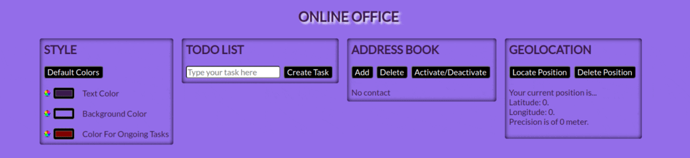

# Online Office

**Project type:** Front-end web project.  
**Brief description:** Web application containing a todo list, an address book, geolocation, as well as a "style" module allowing to change the app's colors.  
**Technologies:** HTML5, CSS3, JavaScript.  

This is a vanilla JavaScript project from the bootcamp, or more like, several vanilla JS projects merged into one. The different modules of Online Office are laid out in an automatic manner thanks to the flexbox, offering a reponsive display. Additionally, even though this is a front-end application, data persists even after the page is refreshed or closed thanks to the localstorage.

